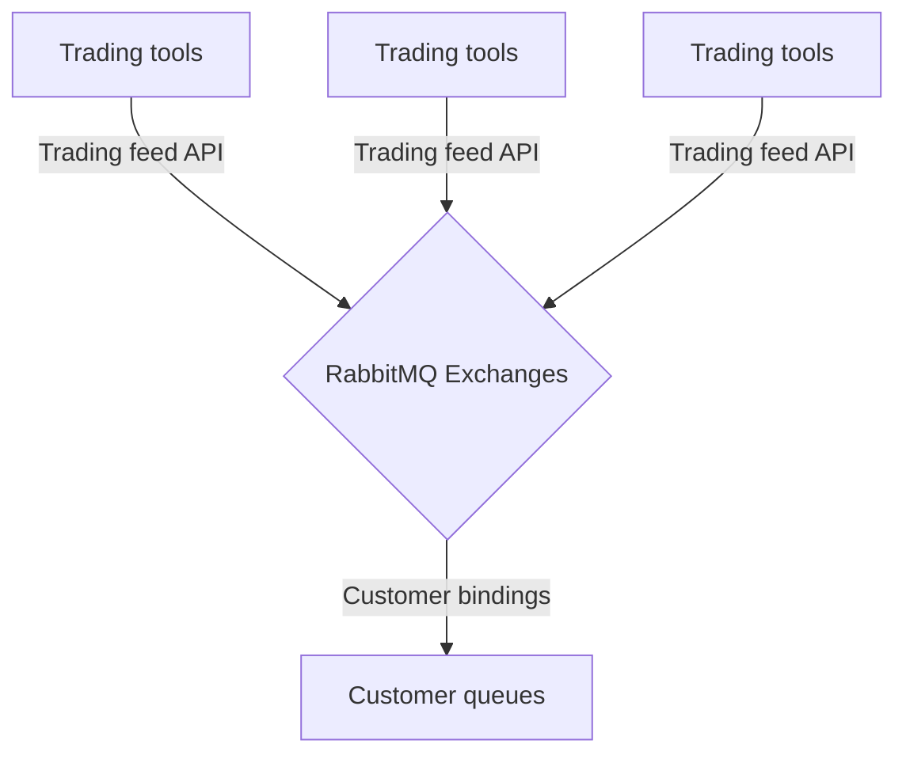

# BGC Integration API

This repository contains the main definitions, concepts and API specs for the BGC system.

- [Terms](#terms)
- [Overview](#overview)
- [Key features](#key-features)
- [BGC API anatomy](#bgc-api-anatomy)
- [REST API Endpoints](#rest-api-endpoints)
  - [Data recovery flows](#data-recovery-flows)
  - [Historical data access](#historical-data-access)
- [Integration flow](#integration-flow)
  - [RabbitMQ binding schemas](#rabbimq-binding-schemas)
- [Trading feeds](#trading-feeds)
  - [GT feed](#gt-feed)
  - [BT feed](#bt-feed)
  - [ST feed](#st-feed)
- [Client Console Guide](#client-console-guide)
- [Risk management flows](#risk-management-flows)
- [Support policies](#support-policies)

## Terms
- **Event**: This term is typically used to refer to a bettable event - a soccer match, for example. This term also overlaps with a more technical meaning. It will be indicated as a **Technical Event** where the technical meaning is used.
- **Trader**: The person or entities working with trading and scout tools to create and manage events, markets and other bettable content like scores and incidents.
- **Operator**: The person or entities which directly interacts with the BGC API. For example, this could be a company which runs a Sportsbook.
- **User**: The person or entity which interacts with the Operator’s system.

## Overview
BGC, which stands for Betting Gateway Cluster, is a cutting-edge platform that revolutionizes the betting industry by providing a comprehensive API to aggregate feeds from various traders, disciplines and bettable content. Designed to enhance user experience and streamline operations for iGaming businesses, BGC serves as a central hub for accessing real-time data, odds, and insights from a multitude of betting sources.

## Key Features

**Unified API Integration**
: BGC seamlessly integrates with the most reliable traders, consolidating their feeds into a unified and managed API. This allows operators to access a wide range of betting data through a single interface, simplifying the integration process and reducing the complexity of managing multiple APIs.

**Real-Time Data Aggregation**
: The platform offers real-time data aggregation, ensuring that operators have access to the latest odds, scores, and other relevant information. This capability is crucial for businesses who require up-to-the-minute data to make informed decisions in the fast-paced world of iGaming.

**Customizable Feeds**
: BGC empowers operators to tailor their data feeds according to their specific needs. Whether it's focusing on particular sports, events, or types of bets, the platform allows for customization, providing a personalized experience for operators.

**Reliable Odds Compilation**
: BGC ensures the reliability of odds by aggregating data from multiple sources. This not only enhances the accuracy of the information but also helps operators identify the best odds available in the market, ultimately optimizing their betting strategies.

**Scalability and Flexibility**
: BGC is designed to scale effortlessly, accommodating the growing needs of businesses. Its flexible architecture enables easy integration with existing systems and supports future enhancements, making it a robust solution for diverse stakeholders in the iGaming industry.

**Comprehensive Analytics**
: The platform includes robust analytics tools that empower users to gain insights into betting trends, market fluctuations, and user behavior. These analytics not only aid in strategic decision-making but also contribute to refining betting strategies for improved outcomes.

**Secure and Compliant**
: BGC prioritizes security and compliance, implementing industry-standard protocols to safeguard user data and transactions. The platform adheres to relevant regulations, providing a trustworthy environment for businesses and users alike.

**Data Recovery**
: BGC provides APIs that allow operators to recover their data at any time, whether they're starting a new environment, experiencing live data losses, or facing extended downtime on their end.

## BGC API anatomy
The BGC API consists of two main components: the Platform API and the Trading Feeds APIs. The Platform API serves as a low-level transportation system over RabbitMQ exchanges, facilitating communication at a fundamental level. On the other hand, the Trading Feeds APIs are responsible for describing the platform's domains and data structures related to trading activities. Together, these components form a comprehensive framework that allows seamless communication and understanding of data structures within the BGC platform.

## REST API Endpoints
Being supplementary for streaming data feed, BGC REST API is a
imed to provide it's customers with data recovery and historical data access.

### Data recovery flows
No matter if it's environment cold start or live data loss, any entity can be re-requested by it's id.

### Historical data access
// TODO

## Integration flow
### RabbitMQ binding schemas
// TODO

## Trading feeds
Trading feeds represent technical events and related bettable content in a form of upcoming, live and historical data. 
Each Trading feed is backed by it's own trading and scout tools forming up trader specific domain, market types and data structures. Every single Trading feed API is composed from general domain documentation and repositories defining data structures and transfer objects.

### GT feed
GT feed operates with the following entities:
* sports
* categories
* tournaments
* events
* markets
* markets results
* scores

To see extensive details for GT feed data structures please see the [GT domain](GT-DOMAIN.md) page.

While the GT feed integration flow is straightforward from sport category to tournament event up to market with market results, the most tricky part lays in building the content for users. Every market has a selection key that can be used together with Translations API to get the exact name for the market. For more details see [GT APIs](GT-APIS.md) page.

### BT feed
> Under construction

[//]: # (To see extensive details for BT feed data structures please see the [BT domain]&#40;BT-DOMAIN.md&#41; page.)

### ST feed
> Under construction

[//]: # (To see extensive details for ST feed data structures please see the [ST domain]&#40;ST-DOMAIN.md&#41; page.)

## Client Console Guide
> Under construction

[//]: # (To see Client Console UI examples along with platform operator guide please see the [client console guide]&#40;CLIENT-CONSOLE-GUIDE.md&#41;.)

## Risk management flows
> Under construction

## Support policies
> Under construction